# Context Aware Bangla Text Analyzer for Sentiment, Sarcasm, and Hate Speech Detection

[](https://www.python.org/)
[](https://pytorch.org/)
[](https://huggingface.co/sagorsarker/bangla-bert-base)
[](https://streamlit.io/)
[](https://www.kuet.ac.bd/)
[-teal.svg)](https://www.kuet.ac.bd/)
[](https://opensource.org/licenses/MIT)

> **A Multi-Task Empirical Benchmark across Three Progressive NLP Modeling Paradigms with Cross-Task Sarcastic Polarity Inversion & Interactive Streamlit Dashboard.**

---

## Table of Contents
- [1. Executive Overview](#1-executive-overview)
- [2. Key Novelties & System Highlights](#2-key-novelties--system-highlights)
- [3. End-to-End System Architecture](#3-end-to-end-system-architecture)
- [4. Multi-Task Corpora \& Benchmark Statistics](#4-multi-task-corpora--benchmark-statistics)
- [5. Three Progressive Modeling Paradigms](#5-three-progressive-modeling-paradigms)
- [6. Master Empirical Benchmark Results](#6-master-empirical-benchmark-results)
- [7. Context Aware Ensemble \& Sarcastic Inversion Engine](#7-context-aware-ensemble--sarcastic-inversion-engine)
- [8. Interactive Streamlit Web Application](#8-interactive-streamlit-web-application)
- [9. Repository Structure](#9-repository-structure)
- [10. Installation & Quick Start](#10-installation--quick-start)
- [11. Python Inference API](#11-python-inference-api)
- [12. Team Credits & Work Distribution](#12-team-credits--work-distribution)
- [13. Academic Supervision](#13-academic-supervision)
- [14. Citation](#14-citation)

---

## 1. Executive Overview

Natural Language Processing (NLP) in low-resource and morphologically rich languages like **Bengali** faces severe hurdles in social discourse: non-standard spelling variations, colloquial slurs, figurative praise, and ubiquitous **sarcasm**.

In conventional NLP systems, **Sentiment Analysis**, **Sarcasm Detection**, and **Hate Speech Identification** are addressed as isolated, siloed classification tasks. However, in human communication, these three dimensions are intrinsically coupled:
* Sarcastic statements routinely disguise bitter critique behind glowing superlatives (*e.g.*, *“বাহ! কী অসাধারণ সার্ভিস, তিন ঘণ্টা অপেক্ষা করেও কাজ হলো না!”*). Standalone sentiment classifiers naively misinterpret this as **Positive** due to vocabulary like *“অসাধারণ”* and *“সার্ভিস”*.
* Toxic insults and cyberbullying can contaminate sentiment polarity, necessitating strict toxicity-sentiment semantic coherence.

This repository presents **Context Aware Bangla Text Analyzer**, a production-grade, end-to-end NLP framework evaluated across **218,371 annotated Bengali sentences**. We systematically train, benchmark, and compare **three progressive NLP modeling paradigms**, pair them with a specialized **Negation-Preserving Preprocessing Engine**, and unite them through a **Context Aware Cross-Task Decision & Inversion Engine** deployed via an interactive **Streamlit** dashboard.

---

## 2. Key Novelties & System Highlights

1. **Massive Unified Multi-Task Benchmark (218,371 Sentences):**
   - **Sentiment Analysis:** 156,010 samples (BanglaBook Rokomari corpus).
   - **Sarcasm Detection:** 12,089 samples (BanglaSarc3 social media corpus).
   - **Hate Speech Detection:** 50,272 samples (Toxic multi-domain corpus).
2. **Three-Tier Progressive Modeling Paradigms:**
   - **Paradigm 1 (Statistical):** Sublinear TF-IDF $(1, 2)$-grams with class-balanced Logistic Regression.
   - **Paradigm 2 (Sequential Recurrent):** Custom 128-dimensional continuous Word2Vec embedding space paired with a 2-layer Stacked Bidirectional LSTM (BiLSTM) with dropout.
   - **Paradigm 3 (Contextual Transformer):** Fine-tuned 110-million parameter `sagorsarker/bangla-bert-base` transformer with full self-attention over subword units.
3. **Negation-Preserving Linguistic Normalizer:**
   - Standard NLP stopword routines strip critical polarity-reversing negation particles (*e.g.*, *না, নয়, নেই, নি, কখনো না*). Our normalizer preserves these essential markers while purging emojis, non-Bengali characters, and zero-width non-joiner artifacts.
4. **Context Aware Cross-Task Ensembling Engine:**
   - Dynamically couples joint posterior distributions $P(\text{Sentiment})$ and $P(\text{Sarcasm})$ to detect semantic incongruity and resolve **sarcastic polarity inversion** to True Negative.
   - Incorporates an **Objectivity Filter** to safeguard against majority-class review bias on everyday factual statements (*e.g.*, *“আমি ভাত খাই”*, *“ঢাকা বাংলাদেশের রাজধানী”*).
5. **Production-Ready Web Dashboard:**
   - Full dark-mode glassmorphism interface built with Streamlit, providing real-time multi-model comparative predictions, latency benchmarks, linguistic token inspection, and interactive confusion matrices.

---

## 3. End-to-End System Architecture

The following diagram illustrates the complete data flow, training paradigms, and the cross-task ensembling inference pipeline:

```mermaid
flowchart TD
    subgraph Data["1. Multi-Task Corpora (N = 218,371)"]
        D1["Sentiment (156,010)"]
        D2["Sarcasm (12,089)"]
        D3["Hate Speech (50,272)"]
    end

    subgraph Preproc["2. Preprocessing & Partitioning"]
        P1["Unicode Normalization & Noise Filtering"]
        P2["Negation Marker Protection ('না', 'নয়', 'নেই')"]
        P3["Stratified Splits: Train (70%) | Val (10%) | Test (20%)"]
    end

    subgraph Paradigms["3. Progressive Modeling Paradigms"]
        M1["Paradigm 1: Statistical\nSublinear TF-IDF (1,2)-grams\n+ Balanced Logistic Regression"]
        M2["Paradigm 2: Sequential Deep Learning\n128-d Word2Vec Embeddings\n+ 2-Layer Stacked BiLSTM"]
        M3["Paradigm 3: Contextual Transformer\nFine-Tuned BanglaBERT (110M)\nSubword WordPiece Attention"]
    end

    subgraph Ensemble["4. Context Aware Cross-Task Decision Engine"]
        E1["Soft Probability Blending\nP_blend = 0.45 P_BERT + 0.35 P_BiLSTM + 0.20 P_LR"]
        E2["Cross-Task Semantic Rules\n• Sarcasm Inversion (Praise + Negation -> Negative)\n• Objectivity Filter (Factual Neutral Preservation)\n• Toxicity Alignment (Hate Speech -> Negative)"]
    end

    subgraph Interface["5. Deployment & User Interface"]
        UI1["Interactive Streamlit Web Dashboard"]
        UI2["Live Multi-Model Comparison Matrix"]
        UI3["Offline Low-Latency Inference Engine"]
    end

    Data --> Preproc
    Preproc --> Paradigms
    Paradigms --> Ensemble
    Ensemble --> Interface
```



---

## 4. Multi-Task Corpora & Benchmark Statistics

All models were evaluated on identical, stratified test splits ($70\%$ Train, $10\%$ Validation, $20\%$ Test):

| Task Domain | Source Dataset | Total Samples | Train Set ($70\%$) | Val Set ($10\%$) | Test Set ($20\%$) | Class Distribution |
| :--- | :--- | :---: | :---: | :---: | :---: | :--- |
| **Sentiment Analysis** | *BanglaBook* (Rokomari) | **156,010** | 109,207 | 15,601 | 31,202 | Positive: 88.6%, Neutral: 6.7%, Negative: 4.7% |
| **Sarcasm Detection** | *BanglaSarc3* (Social Media) | **12,089** | 8,462 | 1,209 | 2,418 | Non-Sarcastic: 59.8%, Sarcastic: 40.2% |
| **Hate Speech Detection**| Multi-Domain Social Corpus | **50,272** | 35,190 | 5,027 | 10,055 | Non-Hate: 50.1%, Hate Speech: 49.9% |
| **Total Corpora** | **Unified Benchmark** | **218,371** | **152,859** | **21,837** | **43,675** | **Fully Stratified & Benchmarked** |

---

## 5. Three Progressive Modeling Paradigms

```
+---------------------------------------------------------------------------------------+
|                               MODELING PARADIGMS                                      |
+--------------------------+-------------------------------+----------------------------+
| 1. Statistical Baseline  | 2. Deep Sequential Recurrent  | 3. Pretrained Transformer  |
| TF-IDF + Logistic Reg.   | Word2Vec (128-d) + BiLSTM     | Fine-Tuned BanglaBERT      |
| ~2 ms latency            | ~5 ms latency                 | ~42 ms latency             |
| Sparse N-Gram Matrix     | Dense Word Representations    | 12-Layer Self-Attention    |
| Class-Balanced Penalty   | Hidden State Concatenation    | Bidirectional Context      |
+--------------------------+-------------------------------+----------------------------+
```

### 1. Paradigm 1: Sublinear TF-IDF + Logistic Regression
* **Feature Extraction:** Sublinear term frequency scaling ($1 + \log(\text{tf})$) with unigram and bigram ranges ($(1, 2)$-grams), limited to the top 20,000 discriminative features.
* **Classifier:** Multinomial Logistic Regression with L2 regularization ($C=1.0$) and `class_weight='balanced'` to offset the extreme $88.6\%$ positive sentiment class skew.
* **Strengths:** Ultra-low latency ($\sim 2\text{ ms}$), impervious to out-of-vocabulary hallucinations, and highly effective for explicit sentiment keywords.

### 2. Paradigm 2: Continuous Word2Vec + Stacked BiLSTM
* **Embedding Layer:** Custom 128-dimensional dense continuous word vectors trained via Skip-gram with negative sampling ($5$ words context window, min frequency $2$).
* **Recurrent Core:** 2-layer stacked Bidirectional Long Short-Term Memory (BiLSTM) with $128$ hidden units per direction ($256$ concatenated) and recurrent dropout ($p=0.3$).
* **Strengths:** Captures sequential word order and directional intent. Achieved strong performance on Hate Speech classification (**88.52% Accuracy, 88.50% Macro F1**).

### 3. Paradigm 3: Fine-Tuned BanglaBERT Contextual Transformer
* **Base Model:** `sagorsarker/bangla-bert-base` (110M parameters, 12 attention heads, 768 hidden dimension, 32,000 WordPiece vocabulary).
* **Fine-Tuning:** Trained using AdamW optimizer with linear warmup decay, learning rate $2 \times 10^{-5}$, max sequence length $128$, and FP16 mixed-precision acceleration.
* **Strengths:** Global bidirectional contextual attention. Captured subtle clause contradictions, dominating both Hate Speech (**91.59% Accuracy, 91.58% Macro F1**) and Sarcasm Detection (**76.76% Accuracy, 74.89% Macro F1**).

---

## 6. Master Empirical Benchmark Results

All metrics were computed on the **identical, held-out test splits** using exact ground-truth labels:

| Target Task | Modeling Paradigm | Accuracy (%) | Macro Precision (%) | Macro Recall (%) | Macro F1 (%) | Weighted F1 (%) |
| :--- | :--- | :---: | :---: | :---: | :---: | :---: |
| **Sentiment Analysis** | **TF-IDF + Logistic Regression** | **77.60%** | **50.78%** | **67.13%** | **53.71%** | **82.24%** |
| *(156,010 samples)* | Word2Vec + Stacked BiLSTM | 76.60% | 52.75% | 63.23% | 53.27% | 81.96% |
| | Fine-Tuned BanglaBERT | 76.39% | 48.81% | 64.57% | 51.51% | 81.29% |
| :--- | :--- | :---: | :---: | :---: | :---: | :---: |
| **Sarcasm Detection** | TF-IDF + Logistic Regression | 74.94% | 72.37% | 74.09% | 72.89% | 75.40% |
| *(12,089 samples)* | Word2Vec + Stacked BiLSTM | 74.36% | 71.53% | 72.84% | 72.00% | 74.74% |
| | **Fine-Tuned BanglaBERT** | **76.76%** | **74.30%** | **76.21%** | **74.89%** | **77.19%** |
| :--- | :--- | :---: | :---: | :---: | :---: | :---: |
| **Hate Speech Detection**| TF-IDF + Logistic Regression | 86.61% | 86.96% | 86.42% | 86.52% | 86.57% |
| *(50,272 samples)* | Word2Vec + Stacked BiLSTM | 88.52% | 88.54% | 88.47% | 88.50% | 88.52% |
| | **Fine-Tuned BanglaBERT** | **91.59%** | **91.56%** | **91.60%** | **91.58%** | **91.59%** |


### Key Academic Insights & Findings
1. **The "No Free Lunch" Dynamic:** No single model wins every domain. Transformer self-attention is state-of-the-art on complex context tasks (Hate Speech & Sarcasm), while class-balanced statistical baselines (TF-IDF + LR) provide the highest stability and recall on heavily skewed, keyword-centric corpora.
2. **Class Imbalance Impact on Sentiment:** While Weighted F1 exceeded $81\%$, Macro F1 hovered between $51.5\%$ and $53.7\%$, reflecting the severe $88.6\%$ positive class skew inherent to commercial book reviews.
3. **Error Space Diversity:** The models produce partially uncorrelated error patterns ($\text{Cov}(e_{\text{BERT}}, e_{\text{BiLSTM}}) < 1$), providing the mathematical justification for soft probability consensus blending.

---

## 7. Context Aware Ensemble & Sarcastic Inversion Engine

Standard multi-model setups perform simple hard model selection (*winner-takes-all*). In contrast, our system features a **Cross-Task Semantic Decision Engine**:

```
                                  [ Input Bengali Text ]
                                             |
            +--------------------------------+-------------------------------+
            |                                |                               |
   [ TF-IDF + LR ]                [ Word2Vec + BiLSTM ]             [ BanglaBERT ]
            |                                |                               |
            +--------------------------------+-------------------------------+
                                             |
                      [ Weighted Soft Probability Blending ]
               P_blend = 0.45*P_BERT + 0.35*P_BiLSTM + 0.20*P_LR
                                             |
                      [ Cross-Task Semantic Decision Rules ]
                                             |
    +----------------------------------------+---------------------------------------+
    |                                        |                                       |
[ Objectivity Filter ]             [ Sarcasm Inversion ]                 [ Toxicity Alignment ]
Lacks emotional charge             Sarcastic + Praise + Negation         Hate Speech detected
-> Final: NEUTRAL                  -> Flip Positive to NEGATIVE          -> Enforce NEGATIVE
```

### Real-World Decision Walkthroughs

| Input Sentence (Bangla) | English Translation / Context | Raw Model Output | Context Aware Ensemble Output | Resolution Logic |
| :--- | :--- | :--- | :--- | :--- |
| **“বাহ! কী অসাধারণ সার্ভিস, তিন ঘণ্টা অপেক্ষা করেও কোনো কাজ হলো না!”** | *“Wow! What extraordinary service, even after waiting three hours nothing was done!”* | Sentiment: Positive (81%)<br>Sarcasm: Sarcastic (78%) | **Sentiment: Negative (68%)**<br>**Sarcasm: Sarcastic**<br>**Hate Speech: Non-Hate** | **Sarcastic Polarity Inversion:** Surface praise (*অসাধারণ*) contradicted by negation (*কাজ হলো না*) inverts sentiment to True Negative. |
| **“অসাধারন হইছে”** | *“It has been extraordinary / great!”* | All models: Positive (>80%)<br>Sarcasm: Non-Sarcastic | **Sentiment: Positive (81.1%)**<br>**Sarcasm: Non-Sarcastic**<br>**Hate Speech: Non-Hate** | **Multi-Model Positive Consensus:** High-confidence affirmative evaluation respected without neutral override. |
| **“আমি ভাত খাই”** | *“I eat rice.” (Everyday factual action)* | Models: Negative (Review-bias artifact) | **Sentiment: Neutral (68.0%)**<br>**Sarcasm: Non-Sarcastic**<br>**Hate Speech: Non-Hate** | **Objectivity Filter:** Zero sentiment polarity lexicon, zero negation, zero sarcasm triggers neutral preservation. |
| **“তোদের মতো অমানুষদের এই দেশে থাকার কোনো অধিকার নাই!”** | *“Inhumans like you have no right to live in this country!”* | Hate: Hate Speech (91%) | **Sentiment: Negative (85.0%)**<br>**Sarcasm: Non-Sarcastic**<br>**Hate Speech: Hate Speech** | **Toxicity Alignment:** Cyberbullying and hate speech strictly enforces negative sentiment. |

---

## 8. Interactive Streamlit Web Application

The user interface (`Project files/app.py`) is structured into **4 functional tabs**:

1. 🚀 **Live Multi-Task Analyzer:**
   - Real-time text input area with character and word counters.
   - Dynamic Model Switcher: Toggle between *Context Aware Ensemble (Recommended)*, *TF-IDF + LR*, *Stacked BiLSTM*, and *Fine-Tuned BanglaBERT*.
   - One-click proposal benchmark test presets.
   - Metric cards with live confidence progress bars and linguistic token diagnosis.
2. 📊 **Master Benchmark Matrix:**
   - Interactive comparative performance tables and side-by-side metric charts across all paradigms.
3. 📈 **Dataset & EDA Statistics:**
   - Class distribution bar plots, sentence length histograms ($P_{95} = 45$ tokens), and n-gram frequency insights.
4. 🎯 **Confusion Matrices:**
   - High-resolution normalized confusion matrix heatmaps for all 3 paradigms across all 3 tasks.

---

## 9. Repository Structure

```
.
├── Dataset/                                 # Raw Multi-Task Datasets
│   ├── Sentiment/                           # BanglaBook (156,010 samples)
│   ├── Sarcasm/                             # BanglaSarc3 (12,089 samples)
│   └── Hate Speech/                         # Multi-domain toxic corpus (50,272 samples)
├── Project files/
│   ├── app.py                               # Production Streamlit Interactive Web Application
│   ├── cleaned_data/                        # Stratified Train / Val / Test (70:10:20) CSV partitions
│   │   ├── sentiment/                       # train.csv, val.csv, test.csv
│   │   ├── sarcasm/                         # train.csv, val.csv, test.csv
│   │   └── hate_speech/                     # train.csv, val.csv, test.csv
│   ├── figures/                             # High-resolution architectural and flow diagrams
│   ├── master_benchmark.json                # Consolidated multi-model empirical evaluation metrics
│   ├── notebooks/
│   │   ├── NLP_Project.ipynb                # Master narrative Jupyter notebook (Labs 1-5 + Pipeline)
│   │   └── interactive_model_tester.ipynb   # Lightweight real-time testing playground
│   ├── report/
│   │   ├── main.tex                         # Complete publication-grade LaTeX report
│   │   ├── main.pdf                         # Compiled 14-page KUET official technical report
│   │   └── figures/                         # Vector TikZ plots, confusion matrices, and EDA charts
│   ├── saved_models/                        # Serialized model artifacts (Weights, Vectors, Tokenizers)
│   │   ├── lr/                              # TF-IDF vectorizers & Logistic Regression .pkl models
│   │   ├── bilstm/                          # Word2Vec .model & PyTorch Stacked BiLSTM .pt checkpoints
│   │   └── banglabert/                      # Fine-tuned BanglaBERT weights & tokenizer configuration
│   ├── src/                                 # Core Production Codebase
│   │   ├── preprocessing.py                 # Unicode normalization & negation-preserving tokenizer
│   │   ├── train_tfidf_lr.py                # Paradigm 1 training & benchmarking pipeline
│   │   ├── train_word2vec.py                # 128-d continuous embedding space trainer
│   │   ├── train_bilstm.py                  # Paradigm 2 PyTorch recurrent training script
│   │   ├── predict_lr.py                    # Standalone TF-IDF+LR inference wrapper
│   │   ├── predict_bilstm.py                # Standalone BiLSTM inference wrapper
│   │   ├── predict_bert.py                  # Standalone BanglaBERT inference wrapper
│   │   ├── inference_pipeline.py            # Unified Context Aware Multi-Task Ensemble Engine
│   │   └── evaluate_master_benchmark.py     # Master benchmark calculation and plot generator
│   └── requirements.txt                     # Pinned Python dependencies
├── run_app.bat                              # One-click Windows local launcher for Streamlit App
└── README.md                                # Master repository documentation
```

---

## 10. Installation & Quick Start

### Prerequisites
* Python 3.10 or higher
* Recommended: Virtual environment (`venv` or `conda`)
* Optional: NVIDIA GPU with CUDA 11.8+ (for accelerated inference on BanglaBERT)

### 1. Clone the Repository
```bash
git clone https://github.com/Siyam216/Context_Aware_Bangla_Text.git
cd Context_Aware_Bangla_Text
```

### 2. Set Up Virtual Environment & Dependencies
```bash
# Create and activate virtual environment
python -m venv .venv

# On Windows:
.venv\Scripts\activate

# On Linux/macOS:
source .venv/bin/activate

# Install required dependencies
pip install --upgrade pip
pip install -r "Project files/requirements.txt"
```

### 3. Launch the Interactive Web Application

#### Option A: Windows One-Click Launcher
Double-click `run_app.bat` or run in terminal:
```bash
.\run_app.bat
```

#### Option B: Terminal Command
```bash
streamlit run "Project files/app.py"
```
The application will automatically initialize and open in your browser at `http://localhost:8501`.

---

## 11. Python Inference API

You can use the unified inference engine directly within your own Python scripts:

```python
import sys
sys.path.insert(0, "Project files/src")
from inference_pipeline import UnifiedBanglaTextAnalyzer

# Initialize analyzer (loads models locally)
analyzer = UnifiedBanglaTextAnalyzer()

# Test sample with sarcastic contrast
text = "বাহ! কী অসাধারণ সার্ভিস, তিন ঘণ্টা অপেক্ষা করেও কোনো কাজ হলো না!"

# Run Context Aware Ensemble
result = analyzer.analyze(text, model_type="ensemble")

print(f"Text: {result['raw_text']}")
print(f"Sentiment : {result['sentiment']['label']} ({result['sentiment']['confidence']}%) [Inverted: {result['sentiment']['context_inverted']}]")
print(f"Sarcasm   : {result['sarcasm']['label']} ({result['sarcasm']['confidence']}%)")
print(f"Hate Speech: {result['hate_speech']['label']} ({result['hate_speech']['confidence']}%)")
```

**Output:**
```
Text: বাহ! কী অসাধারণ সার্ভিস, তিন ঘণ্টা অপেক্ষা করেও কোনো কাজ হলো না!
Sentiment : Negative (68.0%) [Inverted: True]
Sarcasm   : Sarcastic (65.0%)
Hate Speech: Non-Hate (98.31%)
```

---

## 12. Team Credits & Work Distribution

This project was developed by 4th-year undergraduate students in the Department of Computer Science and Engineering, Khulna University of Engineering & Technology (KUET):

| Member Name | Student Roll | Primary Research & Technical Contributions |
| :--- | :---: | :--- |
| **Md. Tariful Islam Jony** | **2107119** | • **Paradigm 3:** Pretrained Contextual Transformer (`BanglaBERT`) Fine-Tuning & Optimization.<br>• **Ensemble Engine:** Cross-task Soft Blending, Sarcastic Inversion & Toxicity Alignment logic.<br>• **Data Engineering:** Raw corpus unification, Unicode regex normalization & negation preservation.<br>• **User Interface:** Streamlit interactive web dashboard, glassmorphism layout & real-time inference views. |
| **Siyam Khan** | **2107120** | • **Paradigm 1:** Sublinear TF-IDF $(1,2)$-grams & Class-Balanced Logistic Regression baseline.<br>• **Paradigm 2:** Continuous 128-d Word2Vec vector space training & Stacked BiLSTM neural implementation.<br>• **Empirical Evaluation:** Test set partitioning, confusion matrix generation & Master Benchmark compilation.<br>• **Documentation:** Comprehensive LaTeX technical report authoring, vector TikZ diagrams & repository curation. |

---

## 13. Academic Supervision

* **Dr. K. M. Azharul Hasan**  
  *Professor, Department of Computer Science and Engineering*  
  Khulna University of Engineering & Technology (KUET), Khulna-9203, Bangladesh  

* **Md Nazirulhasan Shawon**  
  *Assistant Professor, Department of Computer Science and Engineering*  
  Khulna University of Engineering & Technology (KUET), Khulna-9203, Bangladesh  

---

## 14. Citation

If you find this work, codebase, or benchmark useful in your academic research or applications, please cite:

```bibtex
@techreport{jony_siyam_2026_bangla_nlp,
  author      = {Md. Tariful Islam Jony and Siyam Khan},
  title       = {Context Aware Bangla Text Analyzer for Sentiment, Sarcasm, and Hate Speech Detection},
  institution = {Khulna University of Engineering \& Technology (KUET)},
  department  = {Department of Computer Science and Engineering},
  type        = {Undergraduate Technical Project Report},
  number      = {CSE 4122},
  year        = {2026},
  address     = {Khulna-9203, Bangladesh}
}
```

---

<p align="center">
  <b>Department of Computer Science and Engineering (CSE)</b><br>
  Khulna University of Engineering & Technology (KUET), Khulna-9203, Bangladesh<br>
  <i>Developed with academic rigor for CSE 4122: Natural Language Processing Laboratory</i>
</p>
